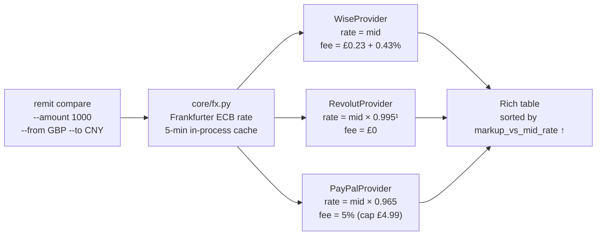

# remit-compare

> Most remittance services hide their true cost in the FX markup, not the fee line. This tool shows you what you're actually paying.

A Python CLI that benchmarks Wise, Revolut, and PayPal against a single neutral baseline — the European Central Bank mid-market rate — and surfaces the real cost of each transfer as a single percentage.

---

## Demo


---

## The Problem

When you send money abroad, every provider shows you a fee. That fee is real, but it is rarely the whole story.

Consider a transfer of **1,000 GBP → CNY** *(numbers from 2026-04-18, a Saturday; Revolut applies a weekend +1% spread — weekday is typically 0.5%)*:

| Provider | Advertised fee | Exchange rate    | You receive | True cost vs mid-rate |
|----------|----------------|------------------|-------------|------------------------|
| Wise     | £4.53          | 9.2331 (mid)     | 9,233 CNY   | **0.45%**              |
| Revolut  | £0.00          | 9.1408 (−1.0%)   | 9,141 CNY   | **1.01%**              |
| PayPal   | £4.99          | 8.9099 (−3.5%)   | 8,910 CNY   | **4.14%**              |

PayPal charges less in fees than Wise — £4.99 vs £4.53 — yet the recipient receives **323 CNY less**, equivalent to roughly **£35 absorbed silently into the exchange rate**. The fee column is misleading; the markup column is not.

The `vs Mid-Rate` figure is computed as:

```
markup = total_cost / (receive_amount / mid_rate) - 1
```

This normalises across providers that take margin in different places (fee vs. spread), producing a single number that can be compared directly regardless of how each provider structures its charges.

---

## How It Works

All providers are evaluated against the same baseline: the ECB mid-market rate fetched from [Frankfurter](https://www.frankfurter.app/) — free, no API key, updated daily at ~16:00 CET. Each provider's fee structure is then applied deterministically from their published rate schedules.



> ¹ ×0.995 on weekdays (Mon–Fri); ×0.990 on weekends (Revolut Standard plan).

Provider requests are issued concurrently via `asyncio.gather`. The ECB rate is cached in-process for 5 minutes, so rapid successive calls do not hit the upstream API repeatedly.

---

## Quick Start

Requires Python 3.11+ and [uv](https://docs.astral.sh/uv/).

```bash
git clone https://github.com/qinhzy/remit-compare
cd remit-compare
uv sync
```

```bash
# Compare 1,000 GBP → CNY
uv run remit compare --amount 1000 --from GBP --to CNY

# Compare 500 USD → EUR
uv run remit compare --amount 500 --from USD --to EUR
```

---

## Supported Providers

| Provider | Fee schedule | Rate basis | Last verified |
|----------|-------------|------------|---------------|
| **Wise** | [wise.com/gb/pricing/send-money](https://wise.com/gb/pricing/send-money) — £0.23 fixed + 0.43% variable (GBP send) | ECB mid, no spread | 2026-04-18 |
| **Revolut** | [revolut.com/en-GB/legal/fees](https://www.revolut.com/en-GB/legal/fees) — Standard plan, £0 transfer fee | ECB mid −0.5% weekday / −1.0% weekend | 2026-04-18 |
| **PayPal** | [paypal.com/us/webapps/mpp/paypal-fees](https://www.paypal.com/us/webapps/mpp/paypal-fees) — 5% (min £0.99, max £4.99) | ECB mid −3.5% conversion margin | 2026-04-18 |

---

## Data Sources & Caveats

**This tool models published rate schedules, not live retail prices.** Treat outputs as directionally accurate comparisons, not exact quotes.

Known gaps:

- **ECB rate vs. retail rate.** Frankfurter provides the ECB reference rate, updated once daily. Intraday retail spreads will differ.
- **Revolut free-tier limits.** The Standard plan includes fee-free exchange up to £1,000/month; amounts above that attract a 0.5% fee, which is not modelled here.
- **PayPal account type.** The 3.5% margin and 5% transfer fee apply to personal accounts. Business accounts and PayPal Checkout operate on different schedules.
- **Wise corridor variation.** Wise's fixed fee (£0.23 for GBP sends) varies by send currency. A small lookup table covers the most common currencies; others fall back to a £0.50 default.
- **Revolut plan tiers.** Plus, Premium, and Metal plans carry lower or zero spreads. Only the free Standard plan is modelled.
- **Weekend FX detection.** The tool reads the current system date (UTC) and applies the appropriate Revolut spread automatically.

---

## Roadmap

**Providers**
- [ ] Western Union (SWIFT + agent network)
- [ ] Remitly (express / economy tiers)
- [ ] Bank of China (CNY corridor benchmark)
- [ ] TransferGo

**Features**
- [ ] 30-day historical markup chart via Frankfurter's dated endpoint (`/YYYY-MM-DD`)
- [ ] `--watch` mode: re-poll on an interval and alert when a rate improves
- [ ] `--format json` / `--format csv` output for downstream scripting
- [ ] Lightweight API server mode (FastAPI wrapper)

---

## Development

```bash
uv sync --extra dev
uv run pytest -x             # 18 tests across core and all three providers
uv run ruff check src tests  # lint
```

---

## License

MIT
